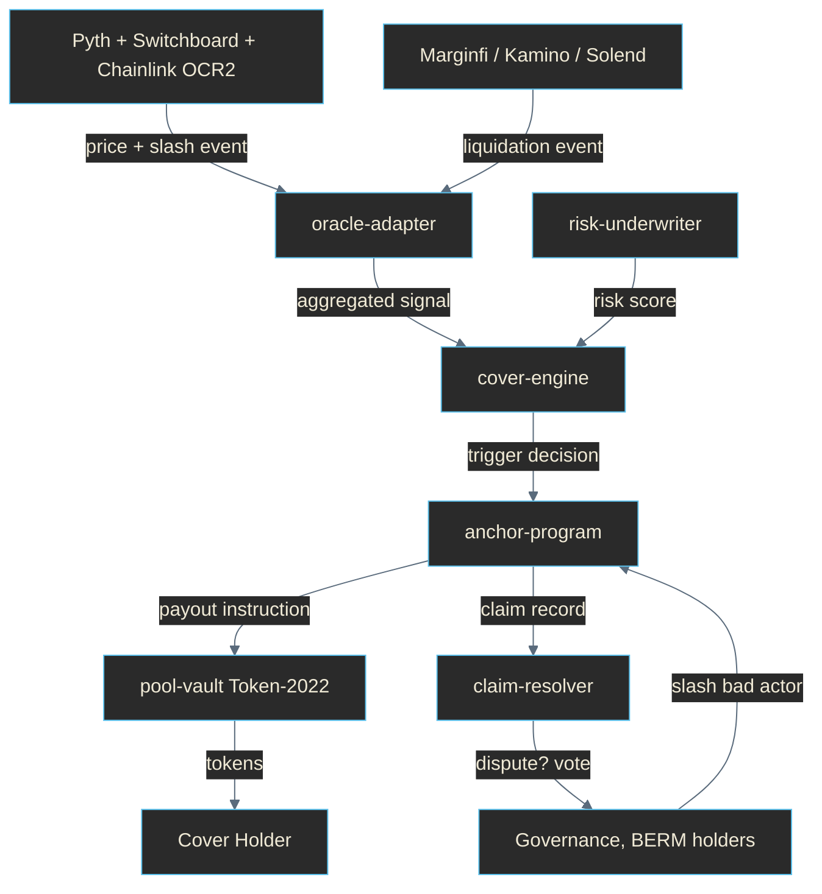

# BERM

[](https://berm.sh)
[](docs/architecture.md)
[](https://x.com/berm_sh)
[](.github/workflows/ci.yml)
[](LICENSE)
[](https://github.com/berm-labs/berm/stargazers)
[](https://www.rust-lang.org/)
[](https://www.typescriptlang.org/)
[](https://docs.solana.com/)

> **CA**
> **CLDBh5rHpc7gVAs8jSJtQ7KCqvjdfVbvfvM3omCpump**

> **Break the wave.**
> Solana's parametric cover layer. Five cover types, dual oracles, automatic settlement.

---

## What is BERM?

BERM is the first parametric DeFi cover protocol on Solana. Cover positions settle automatically when on-chain conditions and oracle data cross a defined threshold -- no claim adjudication, no paperwork, no opaque pool. Five cover types address the most material loss categories in DeFi:

- **ExploitCover** -- protects against smart-contract exploits that drain a covered protocol's TVL.
- **DepegCover** -- protects against stablecoin depeg events sustained beyond a persistence window.
- **SlashingCover** -- protects LST holders against validator slashing.
- **LiquidationCover** -- partially absorbs liquidation losses from Marginfi, Kamino, and Solend positions.
- **OracleCover** -- protects against forced liquidations caused by oracle divergence.

The system is engineered as a monorepo of nine Rust / Anchor crates and TypeScript packages, and is grounded in established parametric-settlement and on-chain underwriting literature (Nexus Mutual, Sherlock, InsurAce, and the World Bank's index-based settlement work). This repository contains the on-chain programs, SDK, CLI, and mobile client; the web frontend is proprietary and not included here.

---

## Architecture



Full data flow and component contracts are in [`docs/architecture.md`](docs/architecture.md).

---

## Repository layout

```
packages/
  cover-engine/        parametric oracle trigger engine (Rust)
  anchor-program/      cover pool executor on Solana (Anchor 0.31)
  pool-vault/          Token-2022 cover pool vault
  risk-underwriter/    protocol risk scoring (Rust)
  claim-resolver/      auto-trigger + governance dispute (Anchor + Rust)
  oracle-adapter/      Pyth + Switchboard + Chainlink OCR2
  sdk-ts/              TypeScript SDK -- @berm/sdk
  cli/                 npm global -- berm-cli
  mobile-app/          React Native BERM Alert
docs/
  architecture.md
  cover-spec.md
  security.md
```

The web frontend (cover designer + monitoring dashboard) is proprietary and is
not part of this repository.

---

## Quick start

```bash
# Rust + Anchor
cargo build --release
anchor build

# TypeScript SDK
cd packages/sdk-ts && npm install && npm run build

# CLI
cd packages/cli && npm install && npm run build && npm pack
npm i -g ./berm-cli-0.1.0.tgz

# Mobile client
cd packages/mobile-app && npm install && npm run typecheck
```

---

## CLI usage

```bash
berm scan --wallet <ADDR>             # scan wallet risk across cover types
berm cover --type depeg --amount 1000 # purchase a cover position
berm pool list                        # list active cover pools
berm oracle status                    # show Pyth/Switchboard health
berm claim --id <CLAIM_ID>            # check claim auto-trigger status
```

Defaults to `https://api.berm.sh` and the devnet RPC `https://api.devnet.solana.com`. Override the cluster with `--cluster`, or the endpoints with `--api` and `--rpc`. No secrets ever required.

---

## Cover types in detail

See [`docs/cover-spec.md`](docs/cover-spec.md) for full trigger predicates and payout formulas. Quick reference:

| Type | Trigger | Window | Severity |
|------|---------|--------|----------|
| ExploitCover | TVL drop > 35% + abnormal withdrawal | 2 slots | clamped drop ratio |
| DepegCover | price < 0.95 or > 1.05 | 8 slots | clamped depeg depth |
| SlashingCover | validator slashing event recorded on stake feed | 1 epoch | slashed fraction |
| LiquidationCover | Marginfi / Kamino / Solend liquidation instruction | 1 slot | configurable cover ratio |
| OracleCover | Pyth vs Switchboard divergence > 1% | 4 slots | divergence excess |

---

## Cluster

BERM currently runs on **Solana devnet** while final review and integration work continues. The program ID is published in `target/idl/berm.json` after `anchor deploy --provider.cluster devnet`. Mainnet promotion is gated on additional review and is announced in advance via @berm_sh.

---

## Security

Read [`docs/security.md`](docs/security.md) before reviewing the cover engine. Key invariants:

- All settlements are deterministic functions of oracle data and on-chain state.
- Dual oracle (Pyth + Switchboard) gates DepegCover and OracleCover triggers.
- The pool vault uses Token-2022 with multisig authority.
- The claim resolver maintains a dispute path that can override an oracle-triggered settlement via governance vote.

Audits, threat models, and disclosure policy are tracked in `docs/security.md`.

---

## Links

- Site: https://berm.sh
- X: https://x.com/berm_sh
- Docs: [`docs/architecture.md`](docs/architecture.md), [`docs/cover-spec.md`](docs/cover-spec.md), [`docs/security.md`](docs/security.md)

---

## License

MIT.
