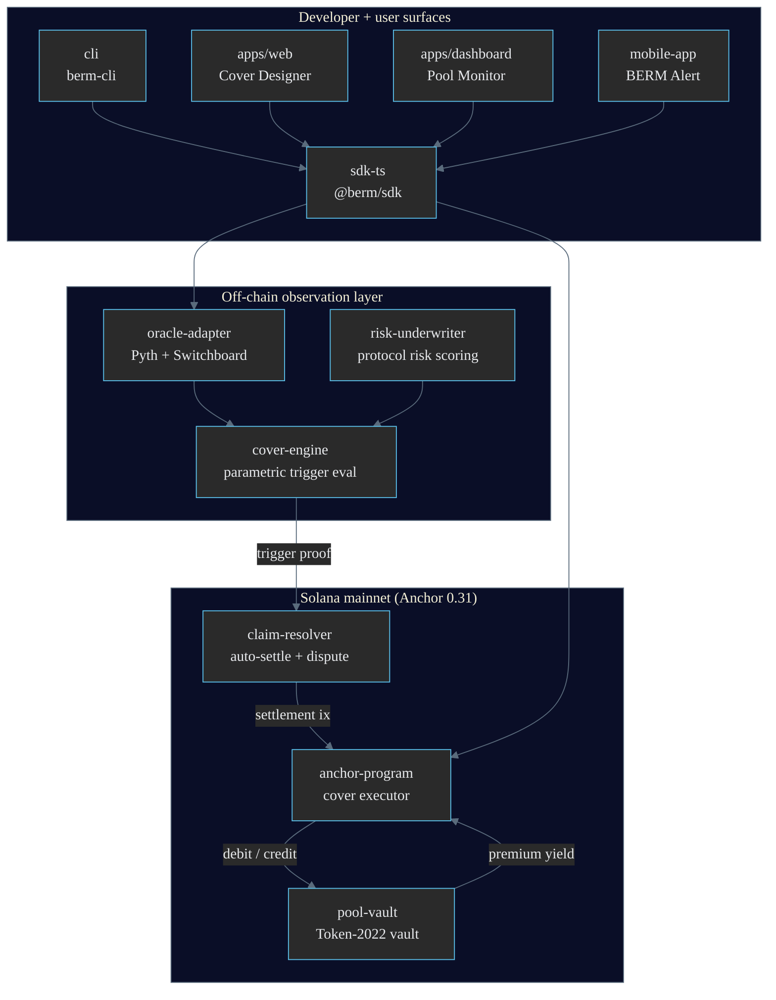
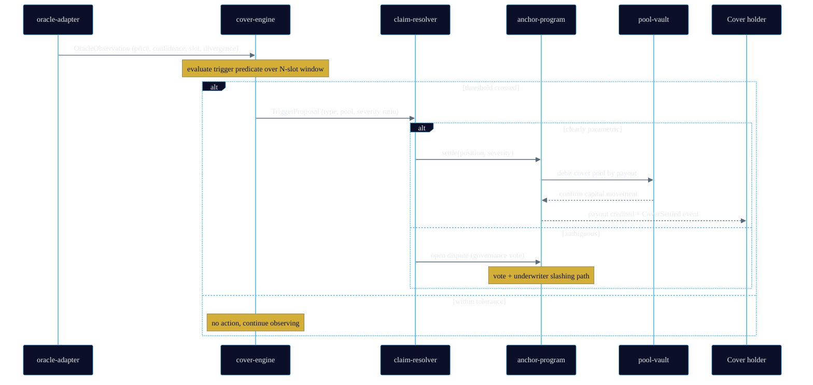
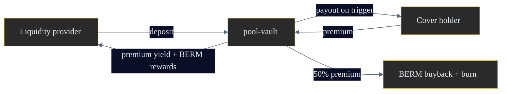
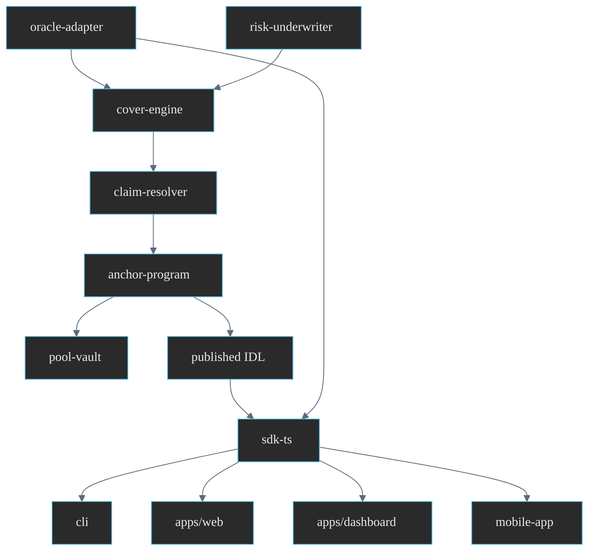

# BERM Architecture

> Solana's first parametric DeFi cover protocol. Oracle-triggered automatic settlement across five cover types, backed by a Token-2022 cover pool vault and an on-chain claim resolver.

This document describes the BERM monorepo, the responsibility of every package and app, and the end-to-end data flow from price feed to settlement.

---

## 1. System overview

BERM is a risk-protection layer for Solana DeFi. Liquidity providers underwrite a shared **cover pool**; protocol users buy **cover positions** against parametric risks (exploit, depeg, slashing, liquidation, oracle divergence). When an on-chain or oracle condition crosses a defined threshold, the **claim resolver** settles eligible positions automatically without a manual claim process. Disputed or ambiguous events fall back to a governance vote with underwriter slashing.

The protocol is deliberately built as a layered monorepo so that the trigger logic (off-chain, fast, observable) is separated from the settlement authority (on-chain, deterministic, auditable). Off-chain components observe, score, and propose; on-chain components custody capital and execute.



---

## 2. Monorepo layout

Nine packages and two apps, plus published documentation. Rust crates own consensus-critical logic; TypeScript packages own client integration and tooling.

```
packages/
  cover-engine/      Rust   parametric oracle trigger evaluation + settlement proposal
  anchor-program/    Anchor cover pool executor + claim resolver contract + public IDL
  pool-vault/        Anchor Token-2022 cover pool vault: LP capital pooling + premium distribution
  risk-underwriter/  Rust   protocol risk scoring (TVL, audits, code complexity, reputation)
  claim-resolver/    Rust   automatic oracle trigger + dispute governance vote + slashing
  oracle-adapter/    Rust   Pyth + Switchboard + Chainlink CCIP multi-oracle aggregation
  sdk-ts/            TS     @berm/sdk developer SDK
  cli/               TS     berm-cli npm package
  mobile-app/        TS     React Native + Solana Mobile SDK + push alerts
apps/
  web/               Next.js Storm Breakwater 3D Cover Designer
  dashboard/         Next.js cover pool statistics + live monitoring
docs/
  architecture.md
  cover-spec.md
  security.md
```

---

## 3. Package responsibilities

### 3.1 cover-engine (Rust)

The parametric brain. Consumes normalized price and state observations and evaluates each active cover type's trigger predicate.

- **Inputs:** aggregated oracle observations from `oracle-adapter`, on-chain TVL snapshots, protocol risk scores from `risk-underwriter`.
- **Outputs:** a signed `TriggerProposal` (cover type, affected pool, severity ratio, observation window, supporting oracle slots).
- **Depends on:** `oracle-adapter`, `risk-underwriter`.
- **Key property:** deterministic given the same observation set. The same window of slots always yields the same severity ratio, so any verifier can replay the decision.

### 3.2 anchor-program (Anchor 0.31)

The on-chain authority. Holds cover pool accounts, cover position accounts, and the executor instructions that move capital.

- **Inputs:** settlement instructions from `claim-resolver`, cover purchase / position-burn instructions from clients.
- **Outputs:** account state mutations, emitted events (`CoverPurchased`, `CoverSettled`, `PremiumDistributed`).
- **Depends on:** `pool-vault` (CPI for capital movement).
- **Key property:** the only component with mint / transfer authority over user funds. Its IDL is published for independent client generation.

### 3.3 pool-vault (Anchor, Token-2022)

The capital custody layer. A Token-2022 vault that pools LP deposits and tracks premium accrual.

- **Inputs:** LP deposits, premium streams from purchased covers, settlement debits.
- **Outputs:** LP share accounting, premium yield credited per epoch.
- **Depends on:** Token-2022 program.
- **Key property:** all authority transitions are multisig-gated; no single key can drain the vault.

### 3.4 risk-underwriter (Rust)

Pricing intelligence. Scores each coverable protocol so premiums reflect real risk rather than a flat rate.

- **Inputs:** protocol TVL, audit count, code complexity metrics, on-chain activity / reputation signals.
- **Outputs:** a normalized risk score (0-100) and a recommended premium rate per cover type.
- **Depends on:** `oracle-adapter` (for TVL/price context).
- **Key property:** scores are inputs to `cover-engine` severity normalization and to client premium quoting.

### 3.5 claim-resolver (Rust)

Settlement orchestration. Turns trigger proposals into on-chain settlement, and arbitrates contested events.

- **Inputs:** `TriggerProposal` from `cover-engine`.
- **Outputs:** settlement instructions to `anchor-program`; for ambiguous events, a governance dispute record.
- **Depends on:** `cover-engine`, `anchor-program`.
- **Key property:** automatic path for clearly parametric events; governance path (vote + underwriter slashing) for the long tail.

### 3.6 oracle-adapter (Rust)

Price truth. Aggregates Pyth and Switchboard (with Chainlink CCIP as a cross-chain reference) into a single normalized observation with divergence flags.

- **Inputs:** Pyth price updates (and Pyth Lazer for low-latency feeds), Switchboard on-demand feeds.
- **Outputs:** normalized `OracleObservation` (price, confidence, publish slot, divergence basis points).
- **Depends on:** Pyth + Switchboard SDKs.
- **Key property:** publishes the divergence signal that `OracleCover` itself triggers on.

### 3.7 sdk-ts (`@berm/sdk`)

The TypeScript developer SDK. Wraps RPC, the published IDL, PDA derivation, and oracle reads behind typed clients (`BermClient`, `CoverPool`, `CoverPosition`, `ClaimResolver`, `RiskScorer`, `OracleAdapter`).

- **Inputs:** RPC endpoint, optional wallet.
- **Outputs:** typed reads and instruction builders for every client surface.
- **Depends on:** `@solana/web3.js`, `@coral-xyz/anchor`, `@solana-program/token-2022`.

### 3.8 cli (`berm-cli`)

Operator and power-user tooling. `berm scan`, `berm cover`, `berm claim` built on top of `@berm/sdk`.

### 3.9 mobile-app (BERM Alert)

React Native + Solana Mobile SDK client. Push notifications for depeg detection, liquidation proximity, and auto-triggered settlements.

### 3.10 apps/web (Cover Designer)

Next.js + Three.js Storm Breakwater landing and Cover Designer. Wallet scan, risk visualization, backtest, share cards.

### 3.11 apps/dashboard (Pool Monitor)

Next.js monitoring surface: pool statistics, live TVL, oracle feed monitor, and historical incident backtests.

---

## 4. Data flow: feed to settlement

The protocol's core loop moves an observation through evaluation, proposal, settlement, and capital movement.



### Steps in words

1. **Observe.** `oracle-adapter` aggregates Pyth and Switchboard into a normalized observation each slot, attaching a confidence band and a divergence measure (basis points between the two sources).
2. **Evaluate.** `cover-engine` runs each active cover type's predicate over a rolling N-slot window. A single off-spec slot does not trigger; the condition must persist to filter transient noise.
3. **Propose.** On a confirmed crossing, `cover-engine` emits a `TriggerProposal` carrying the severity ratio and the supporting slots so the decision is replayable.
4. **Resolve.** `claim-resolver` routes clearly parametric proposals to automatic settlement and ambiguous ones to governance.
5. **Execute.** `anchor-program` applies the settlement, computing each eligible position's payout from the severity ratio and the position's cover amount.
6. **Move capital.** `pool-vault` debits the cover pool for the payout and continues distributing accrued premium yield to LPs on the unaffected balance.

---

## 5. Premium and capital flow

Capital flows in two directions: LPs deposit and earn premium; cover holders pay premium and receive payouts on trigger.



- LPs underwrite the pool and earn the share of premium not routed to buyback, plus $BERM rewards.
- Cover holders pay a risk-scored premium; on a parametric trigger, the pool pays out proportional to severity.
- A portion of premium funds $BERM buyback-and-burn, aligning token value with protocol usage.

---

## 6. Dependency graph



The IDL published by `anchor-program` is the single source of truth for every client. `sdk-ts` consumes it and is in turn consumed by the CLI, both apps, and the mobile client, so a contract change propagates through one regenerated artifact.

---

## 7. Design rationale

- **Off-chain trigger, on-chain authority.** Observation and scoring are cheap and fast off-chain; only the settlement decision touches the chain, keeping gas and account churn minimal while preserving auditability.
- **Persistence windows over instantaneous triggers.** Every parametric condition requires persistence across a slot window. This is the single most important defense against oracle noise and flash manipulation.
- **Dual oracle by construction.** Pyth and Switchboard disagreement is not just tolerated, it is a first-class signal that drives `OracleCover`. See [security.md](./security.md).
- **Replayable proposals.** Every trigger carries its supporting slots so any third party can reproduce the severity computation and challenge it through governance.

See [cover-spec.md](./cover-spec.md) for the precise trigger predicates and payout formulas, and [security.md](./security.md) for the oracle, custody, and governance threat model.
