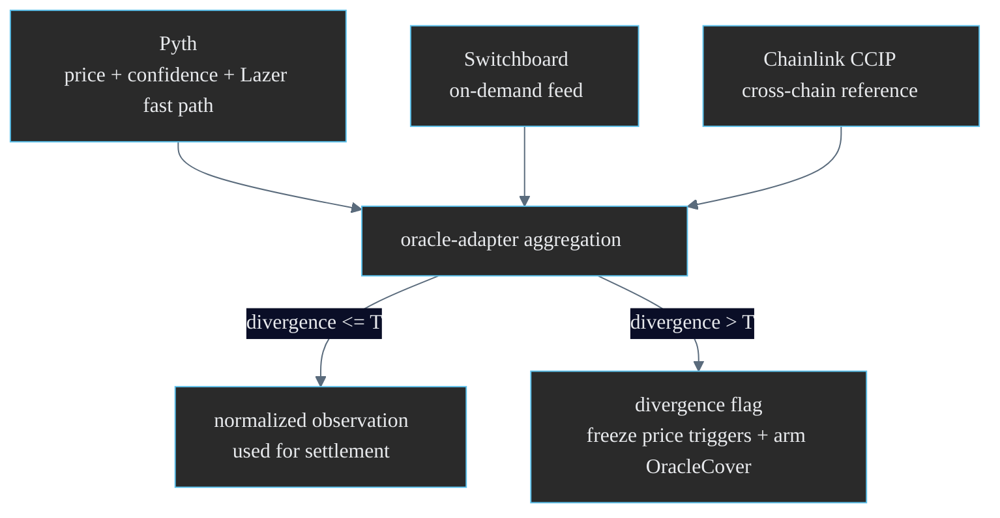
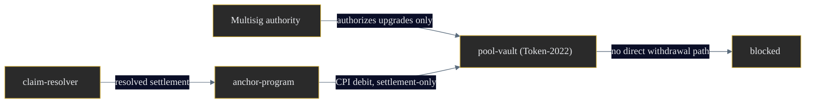
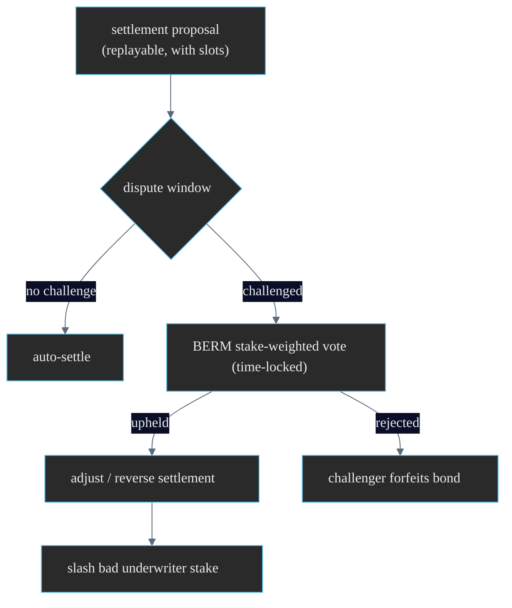

# BERM Security Model

> Oracle integrity, capital custody, and dispute governance for a parametric DeFi cover protocol. This document states the threat model and the defenses BERM applies at each layer.

BERM custodies underwriter capital and settles payouts automatically from oracle data. That combination makes two attack surfaces dominant: **the oracle path** (can an attacker forge a trigger, or suppress a real one?) and **the capital path** (can anyone move vault funds outside settlement?). A third surface, **governance**, covers the ambiguous events that fall outside the automatic path.

> **Deployment status.** Currently deployed to Solana devnet. Mainnet deployment pending additional review. Project site: https://berm.sh. The program identity is configurable per environment in the SDK; the audit and threat model below apply to both clusters.

---

## 1. Dual-oracle design

BERM never trusts a single price source. Every price-dependent cover reads both **Pyth** and **Switchboard**, and the disagreement between them is itself a protocol signal.

### Principles

- **Confidence-aware.** Pyth publishes a confidence interval with every price. `oracle-adapter` rejects observations whose confidence band is too wide to act on, rather than treating a low-confidence print as truth.
- **Lazer fast path.** Pyth Lazer provides low-latency updates for time-sensitive triggers (depeg, oracle divergence) while the standard feed anchors confirmation.
- **Divergence is a signal, not just an error.** When Pyth and Switchboard disagree beyond the threshold, BERM does two things: it **freezes** price-dependent settlement (so a single corrupted feed cannot force a payout) and it **arms OracleCover** (because divergence is exactly the loss event that cover protects against).
- **Persistence windows.** As specified in [cover-spec.md](./cover-spec.md), no price trigger fires on a single slot. Sustained agreement across a window is required, defeating flash-manipulation attempts.

---

## 2. Oracle manipulation analysis

| Attack | Vector | Defense |
|--------|--------|---------|
| Single-feed corruption | Compromise or lag one oracle to forge a trigger | Dual-source agreement required; divergence freezes settlement |
| Flash price spike | One-slot manipulation to cross a threshold | Persistence window `W` requires sustained crossing |
| Confidence widening | Push a low-confidence print to move the aggregate | Confidence-band rejection in `oracle-adapter` |
| Suppression | Withhold updates to hide a real depeg | Stale-slot detection; missing updates flag the feed unhealthy |
| Sandwiched liquidation | Liquidate against a momentarily diverged price | OracleCover settles the diverged-price loss |

The design goal is that no single oracle failure mode can both forge a false payout **and** evade detection. Forging requires defeating two independent sources within a persistence window while keeping confidence bands tight, which is the precise condition OracleCover is built to catch.

---

## 3. Capital custody (Token-2022 vault)

The `pool-vault` is a Token-2022 vault and the only account with custody of underwriter capital.

- **Multisig authority.** Mint, freeze, and withdrawal authorities are held by a multisig, not a single key. No individual signer can move vault funds.
- **Settlement-only debits.** The vault can be debited only by the `anchor-program` executor via CPI, and only in response to a resolved settlement. There is no general transfer path out of the vault.
- **Solvency buffer.** Aggregate outstanding cover may not exceed underwritten capital plus a configured buffer. When a new cover sale would breach the buffer, sales halt for that pool.
- **Token-2022 extensions.** ATA derivation uses the Token-2022 program id explicitly; the vault relies on Token-2022 transfer semantics for accurate accounting.

---

## 4. Dispute governance

Most triggers are unambiguously parametric and settle automatically. The remainder (contested severity, edge-case data, suspected manipulation) route to governance.

- **Dispute window.** After `claim-resolver` proposes a settlement, a challenge window allows any party to dispute by re-deriving severity from the published supporting slots. Because proposals are replayable, disputes are evidence-based, not opinion-based.
- **Vote.** $BERM holders vote on disputed events. Voting weight is stake-weighted with a time lock to discourage flash-loan governance attacks.
- **Underwriter slashing.** Underwriters stake $BERM and reputation against the risk scores they publish. A proven-bad score (e.g. systematically underpricing a protocol that then suffers a covered loss) is slashable, aligning underwriter incentives with pool solvency.
- **Resolution.** A successful dispute reverses or adjusts the proposed settlement; a failed dispute forfeits the challenger's bond.

---

## 5. Governance attack analysis

| Attack | Vector | Defense |
|--------|--------|---------|
| Flash-loan vote | Borrow $BERM to swing a dispute in one block | Time-locked, stake-weighted voting; borrowed tokens cannot vote within the lock |
| Spam disputes | Flood the system with frivolous challenges | Challenge bond forfeited on rejection |
| Underwriter collusion | Underprice risk to win premium, then dump | Underwriter staking + slashing on proven-bad scores |
| Bribery / vote buying | Pay holders to vote a direction | Evidence-based disputes: votes must contest the replayable severity, not preference |

---

## 6. Smart-contract risk

- **Anchor 0.31 patterns.** Account constraints (`has_one`, `seeds`, `bump`), explicit ownership checks, and checked arithmetic throughout. No unchecked math on capital paths.
- **PDA discipline.** All PDAs use fixed seed schemes with correct byte widths (u32 seeds as 4-byte little-endian, pubkey seeds as 32 bytes), preventing seed-collision and address-substitution bugs.
- **CPI minimization.** The vault debit is the only privileged CPI, narrowing the trusted surface.
- **Published IDL.** The `anchor-program` IDL is published so clients generate from the canonical contract rather than a hand-maintained copy, and so external reviewers can audit the exact interface.
- **Upgrade governance.** Program upgrades are multisig-gated and subject to the same time lock as dispute votes.

| Risk | Mitigation |
|------|-----------|
| Reentrancy via CPI | Settlement-only debit path; state updated before external calls |
| Integer overflow on payout | Checked arithmetic; payout bounded by `min(C, ...)` |
| Account substitution | `has_one` + seed/bump constraints on every account |
| Stale oracle acceptance | Slot-freshness and confidence checks in `oracle-adapter` |
| Vault drain via upgrade | Multisig + time-locked upgrade authority |

---

## 7. Operational security checklist

- Oracle observations carry slot and confidence; stale or low-confidence prints are rejected before evaluation.
- Every settlement is replayable from published supporting slots.
- Vault authority is multisig; no single-key withdrawal exists.
- Solvency buffer halts new sales before the pool can be over-committed.
- Disputes are evidence-based and bonded; governance is time-locked against flash attacks.
- The contract interface is published as an IDL for independent audit and client generation.

For trigger predicates and payout math see [cover-spec.md](./cover-spec.md); for how these components fit together see [architecture.md](./architecture.md).
